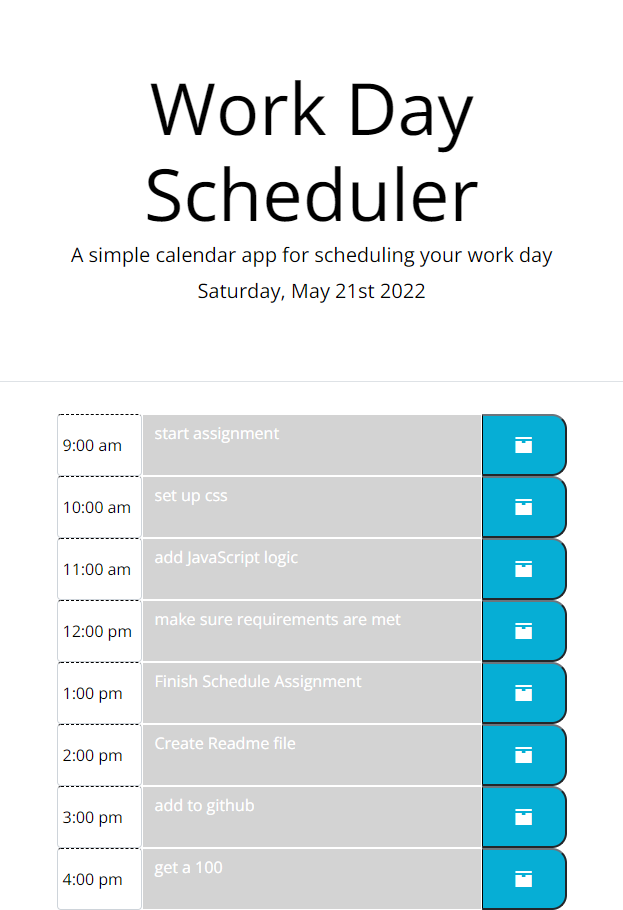

# work_day_scheduler

##Description

This website serves as a scheduling app to keep track of daily tasks. Contains a dynamic layout, with javascript created element. Employsthird party API's like jQuery, Moment.js and Bootstrap.js to add functionality and simplify code. Each element in the page is dynamically created with java script. CSS classes and moment.js methods used to keep track of time and change textarea colors. Tasks saved to local storage so that user never loses the information unless updated. If the task is in the past, the text area turns gray, if it is in the present, it turns red, and if it is in the future, it turns green. Function that checks for the time in order to change styling set to run every 30 minutes.

  

https://jorge30fm.github.io/work_day_scheduler/ (Links to an external site.) - Website Link

https://github.com/jorge30fm/work_day_scheduler (Links to an external site.) - GitHub Link
